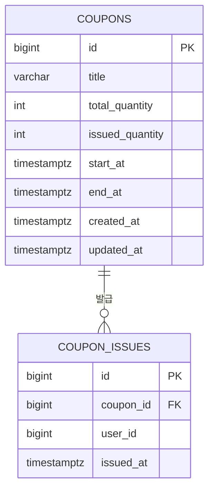

# 쿠폰 도메인 ERD

## 요약

| 항목 | 내용 |
|---|---|
| 범위 | Issue #4 — 쿠폰 도메인 모델링 및 PostgreSQL 스키마(DDL) 정의 |
| 테이블 | `coupons`(쿠폰 마스터), `coupon_issues`(발급 이력) |
| 관계 | `coupons` 1 : N `coupon_issues` |
| 정합성 방어선 | DB 레벨 CHECK/UNIQUE/FK 제약으로 초과 발급·중복 발급·기간 역전을 원천 차단 |
| 관련 파일 | [backend/db/schema.sql](../../backend/db/schema.sql), [backend/src/coupons/entities/](../../backend/src/coupons/entities/) |

---

## 1. ERD

---

## 2. 테이블 정의

### 2.1 `coupons` (쿠폰 마스터)

| 컬럼 | 타입 | 제약 | 설명 |
|---|---|---|---|
| id | BIGSERIAL | PK | 쿠폰 식별자 |
| title | VARCHAR(100) | NOT NULL | 쿠폰명 |
| total_quantity | INT | NOT NULL | 총 발급 가능 수량 |
| issued_quantity | INT | NOT NULL, DEFAULT 0 | 현재까지 발급된 수량 |
| start_at | TIMESTAMPTZ | NOT NULL | 발급 시작 일시 |
| end_at | TIMESTAMPTZ | NOT NULL | 발급 종료 일시 |
| created_at | TIMESTAMPTZ | DEFAULT now() | 생성 일시 |
| updated_at | TIMESTAMPTZ | DEFAULT now() | 수정 일시 |

**CHECK 제약**

| 이름 | 조건 | 목적 |
|---|---|---|
| `chk_coupon_quantity` | `issued_quantity <= total_quantity` | 초과 발급 방지 |
| `chk_coupon_issued_positive` | `issued_quantity >= 0` | 음수 발급 수량 방지 |
| `chk_coupon_period` | `end_at > start_at` | 발급 기간 역전 방지 |

### 2.2 `coupon_issues` (쿠폰 발급 이력)

| 컬럼 | 타입 | 제약 | 설명 |
|---|---|---|---|
| id | BIGSERIAL | PK | 발급 이력 식별자 |
| coupon_id | BIGINT | NOT NULL, FK → coupons.id (ON DELETE RESTRICT) | 발급된 쿠폰 |
| user_id | BIGINT | NOT NULL | 발급받은 사용자 |
| issued_at | TIMESTAMPTZ | DEFAULT now() | 발급 일시 |

**제약 및 인덱스**

| 이름 | 대상 | 목적 |
|---|---|---|
| `uq_coupon_user` | UNIQUE (coupon_id, user_id) | 1인 1매 원칙 보장 |
| `fk_coupon_issues_coupon` | FK (coupon_id) → coupons(id), ON DELETE RESTRICT | 발급 이력이 남아있는 쿠폰은 삭제 불가 |
| `idx_coupon_issues_user` | INDEX (user_id) | 사용자별 발급 이력 조회 성능 |

---

## 3. 설계 의도

- **DB가 최종 방어선**: Issue #5(`SELECT ... FOR UPDATE` 비관적 락), M4(Redis 원자적 연산)로 애플리케이션 레벨 동시성 제어를 고도화하더라도, 로직에 버그가 있거나 락을 우회하는 경로가 생기면 위 CHECK/UNIQUE 제약이 최종적으로 데이터 정합성을 지킨다.
- **`issued_quantity`를 마스터 테이블에 비정규화**: 매 발급마다 `coupon_issues`를 COUNT 하지 않고 `coupons.issued_quantity`를 원자적으로 증가시키는 방식(Issue #5의 락 기반 UPDATE)을 전제로 한 설계. `chk_coupon_quantity`가 이 값이 `total_quantity`를 넘지 못하게 막아준다.
- **`ON DELETE RESTRICT`**: 발급 이력은 감사/정산 목적의 기록이므로, 쿠폰이 삭제되더라도 이력이 함께 삭제되거나 고아 상태가 되는 것을 막는다.

---

## 4. 검증

제약조건이 실제로 거부 동작하는지 로컬 환경(`backend/docker-compose.yml`)에서 검증 완료:

| 테스트 | 기대 결과 |
|---|---|
| `issued_quantity`를 `total_quantity` 초과로 UPDATE | `chk_coupon_quantity` 위반 |
| `issued_quantity`를 음수로 UPDATE | `chk_coupon_issued_positive` 위반 |
| `end_at < start_at`으로 INSERT | `chk_coupon_period` 위반 |
| 동일 (coupon_id, user_id) 중복 INSERT | `uq_coupon_user` 위반 |
| 발급 이력이 있는 쿠폰 DELETE | `fk_coupon_issues_coupon` 위반 |
